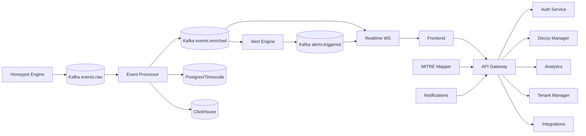

# PHANTOMGRID Architecture

```mermaid
flowchart LR
  FE[Frontend] --> GW[API Gateway]
  GW --> AUTH[Auth Service]
  GW --> DEC[Decoy Manager]
  GW --> ANA[Analytics]
  GW --> TEN[Tenant Manager]
  GW --> INT[Integrations]
  HP[Honeypot Engine] --> K1[(Kafka events.raw)]
  K1 --> EP[Event Processor]
  EP --> K2[(Kafka events.enriched)]
  K2 --> AE[Alert Engine]
  AE --> K3[(Kafka alerts.triggered)]
  K2 --> RT[Realtime WS]
  K3 --> RT
  EP --> PG[(Postgres/Timescale)]
  EP --> CH[(ClickHouse)]
  RT --> FE
  MM[MITRE Mapper] --> GW
  NOTIF[Notifications] --> GW
```
